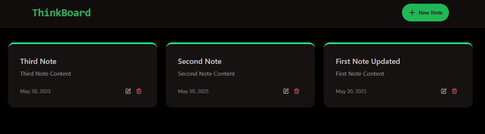

# MERN ThinkBoard

The MERN ThinkBoard is a basic note taking app.

## Features

- User can create, edit, and delete notes.

## Technologies Used

- **Frontend**: React.js, Redux for state management, React Router for navigation
- **Backend**: Node.js, Express.js
- **Database**: MongoDB
- **Upstash**: For Rate Limiting

[Live Demo](https://mern-basic-crud.onrender.com)
